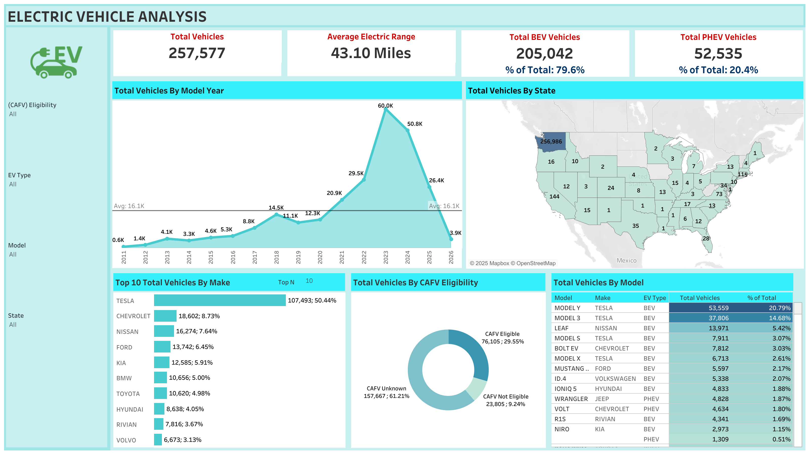

## Electric Vehicles Dashboard — Documentation

### Quick Links
- **Primary workbooks**: `electric_dash.twb`, `electric_dash_revamped.twb`
- **Data file**: `data/Electric_Vehicle_Population_Data.csv`
- **Screenshot**: `ElectricVehicleDashboard.png`

---

### Preview


---

## 1. Overview
- **Dashboard Name/Link**: <a href="https://public.tableau.com/views/electric_dash/ElectricVehicleDashboard?:language=en-US&publish=yes&:sid=&:redirect=auth&:display_count=n&:origin=viz_share_link" target="_blank" rel="noopener noreferrer">Electric Vehicle Analysis</a>
- **Creator**: Bishneet Rekhi
- **Date Created**: August 4, 2025
- **Last Updated**: August 19, 2025
- **Purpose**: Analyze adoption, distribution and trends of Electric Vehicles (EVs) using Washington State registration data.
- **Primary Audience**: Dealerships, electric businesses, potential electric vehicle buyers, researchers, analysts
- **Key Metrics Tracked**:
  - Total Vehicles, Total BEV, Total PHEV
  - Average Electric Range
  - Breakdowns by Make, Model, Model Year, State/County, CAFV Eligibility
- **Business Questions Answered**:
  - What is the current EV mix (BEV vs PHEV)?
  - Which makes/models are most common?
  - How are vehicles distributed across geographies?
  - How has adoption changed by model year?
- **How to Use This Dashboard**: Use the filters to narrow by geography, vehicle type, model year, and eligibility. Interact with charts to drill into specific makes/models.

---

## 2. Data Sources & Connections
- **Data Source Name(s)**: `Electric_Vehicle_Population_Data`
- **Data Source Type(s)**: File (CSV)
- **Data Connection Information**:
  - File path: `data/Electric_Vehicle_Population_Data.csv`
  - Approx. size: ~60 MB, ~257,636 rows
  - Full dataset source: Kaggle — Electric Vehicle Population Data 2025: https://www.kaggle.com/datasets/nuhmanpk/electric-vehicle-population-data-2025
- **Connection Type**: Extract (but live on Tableau Server)
- **Refresh Frequency**: Monthly
- **Joins, Relationships, Unions, Blends**: Single flat file (no joins)
- **Key Filters Applied (Data Source / Extract filters)**: 
  - States AK and IH are excluded
  - Model Year includes values greater than 2011

### Data Fields (from CSV header)
```
VIN (1-10), County, City, State, Postal Code, Model Year, Make, Model,
Electric Vehicle Type, Clean Alternative Fuel Vehicle (CAFV) Eligibility,
Electric Range, Base MSRP, Legislative District, DOL Vehicle ID,
Vehicle Location, Electric Utility, 2020 Census Tract
```

> Notes:
> - `Vehicle Location` is a point string (e.g., `POINT (-122.23 47.30)`).
> - `Electric Vehicle Type` contains values like "Battery Electric Vehicle (BEV)" and "Plug-in Hybrid Electric Vehicle (PHEV)".

---

## 3. Calculated Fields, Parameters & Sets

### Calculated Fields
- **Total BEV Vehicles**: `COUNTD(IF [EV Type] = "Battery Electric Vehicle (BEV)" THEN [DOL Vehicle ID] END)` - Counts unique BEV vehicles (205,042)
- **% of BEV Vehicles**: `[Total BEV Vehicles] / [Total Vehicles]` - Percentage of total vehicles that are BEV (79.6%)
- **Total PHEV Vehicles**: `COUNTD(IF [EV Type] = "Plug-in Hybrid Electric Vehicle (PHEV)" THEN [DOL Vehicle ID] END)` - Counts unique PHEV vehicles (52,535)
- **% of PHEV Vehicles**: `[Total PHEV Vehicles] / [Total Vehicles]` - Percentage of total vehicles that are PHEV (20.4%)
- **Average Electric Range**: `AVG([Electric Range])` - Average electric range across all vehicles (43.10 miles)
- **Total Vehicles**: `COUNTD([DOL Vehicle ID])` - Total count of unique vehicles

### Parameters
- **Top N**: Range 1-15, used to control the number of top vehicles displayed in ranking charts

### Sets
- No sets are currently used in the dashboard

---

## 4. Key Components — Filters & Actions

### Filters
**Context Filters** (affect entire dashboard):
- (CAFV) Eligibility
- EV Type  
- Model
- State
- Model Year

**Regular Filters**:
- Make (active filter on 'Top 10 vehicles by make' chart)

### Dashboard Actions
- **Make Filter Action**: Clicking on a make in the 'Top 10 vehicles by make' chart filters the entire dashboard to show data for that specific make only

---

## 5. Performance Considerations
- **Data Extract Size & Performance Notes**: CSV ~60 MB. Recommend Extract; hide unused fields; enable field indexing; use crosstab-friendly mark counts.
- **Dashboard Load Time**: ~5 seconds average
- **Performance Issues & Fixes**: No known performance issues or bottlenecks identified so far

Suggested optimizations:
- Limit quick filters and prefer parameter-driven toggles when possible.
- Use aggregated extracts at the lowest required granularity.
- Avoid high-cardinality dimensions on the detail shelf when not required.
- Precompute geospatial fields and parse coordinates only once if needed.

---

## 6. Access & Permissions
- **Viewer Access**: Users can view the dashboard but cannot copy data from the Tableau workbook
- **Edit Access**: Bishneet Rekhi (Owner/Editor)

---

## 7. Version Control & Updates
- **Version History**:
  - v1.0 – August 4, 2025 – Initial release (`electric_dash.twb`)
  - v1.1 – August 19, 2025 – Revamped design (`electric_dash_revamped.twb`)
- **Change Log**: Dashboard redesign and optimization between August 4-19, 2025
- **Ownership & Maintenance Plan**: Bishneet Rekhi maintains the dashboard with monthly data refreshes

---

## 8. Workbook Contents
- **Dashboards**: `Electric Vehicle Dashboard`, `Electric Vehicle Dashboard (2)`
- **Worksheets (selected)**:
  - Average Electric Range
  - Top 10 Total Vehicles By Make
  - Total BEV Vehicles
  - Total PHEV Vehicles
  - Total Vehicles
  - Total Vehicles By CAFV Eligibility
  - Total Vehicles By Model
  - Total Vehicles By Model Year
  - Total Vehicles By State

---

## 9. Getting Started (Local)
1. Install Tableau Desktop/Public [2025.2 or later] (workbook shows original-version `18.1`, source-build `2025.2`).
2. Open `electric_dash_revamped.twb`.
3. When prompted, ensure the file `data/Electric_Vehicle_Population_Data.csv` is accessible at the relative path.
4. If using Extracts, refresh the extract once on first open.

---

## 10. Appendix — Data Dictionary (starter)
| Field | Type | Notes |
|---|---|---|
| VIN (1-10) | String | First 10 characters of VIN (masked) |
| County | String | County within WA |
| City | String | City within WA |
| State | String | Expected `WA` |
| Postal Code | String/Int | ZIP code |
| Model Year | Int | Vehicle model year |
| Make | String | Manufacturer (e.g., TESLA, NISSAN) |
| Model | String | Model name (e.g., MODEL 3, LEAF) |
| Electric Vehicle Type | String | `Battery Electric Vehicle (BEV)` or `Plug-in Hybrid Electric Vehicle (PHEV)` |
| Clean Alternative Fuel Vehicle (CAFV) Eligibility | String | Eligibility text |
| Electric Range | Int | Stated electric-only range (miles) |
| Base MSRP | Int | MSRP at base trim (if present) |
| Legislative District | Int | WA legislative district |
| DOL Vehicle ID | String/Int | Identifier |
| Vehicle Location | String | `POINT (lng lat)` |
| Electric Utility | String | Serving utility |
| 2020 Census Tract | String | Census tract identifier |


---

## 11. Notes
- The dashboard is published on Tableau Public and accessible via the link above
- Data refresh occurs monthly to maintain current EV registration information
- The dashboard provides comprehensive insights for stakeholders in the electric vehicle ecosystem


